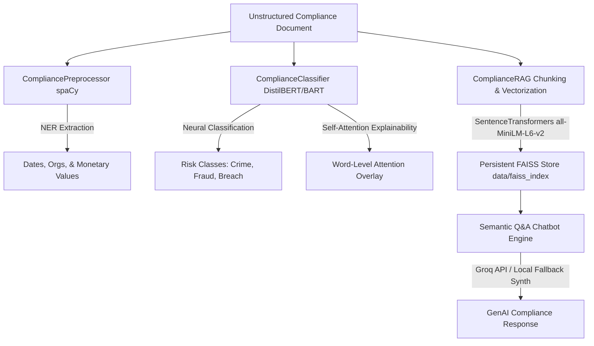

# 🛡️ Regulatory Compliance NLP Classifier & GenAI Report Summarizer

An end-to-end, high-performance intelligent system for automated regulatory risk categorization, explainable AI token mapping, Named Entity Recognition (NER), and Retrieval-Augmented Generation (RAG) conversational Q&A.

This project delivers both a unified **CLI tool** for pipeline integration and fine-tuning, and a premium **glassmorphic Streamlit dashboard** designed for compliance officers to audit documents, explore extracted metadata, view neural explainability heatmaps, and chat with active regulatory corpora.

---

## 🏗️ System Architecture

The workflow below illustrates how documents are ingested, preprocessed, classified with explainable self-attentions, and indexed into a local persistent vector database for semantic Q&A:



---

## ✨ Key Features

*   **🛡️ Multi-Class Compliance Classification**: Categorizes regulatory filings and legal texts into high-priority classes: **Financial Crime**, **Fraud**, and **Regulatory Breach** using a custom fine-tuned DistilBERT model (with dynamic zero-shot `facebook/bart-large-mnli` fallbacks).
*   **👁️ Word-Level Self-Attention Explainability**: Computes aggregate self-attention weights from the model's final encoder layer to highlight exact keywords influencing the neural risk categorization.
*   **🏷️ High-Speed spaCy NER Preprocessing**: Extracts critical metadata such as Dates, Organizations, and Monetary values with character-exact offsets.
*   **💬 Conversational RAG with Resilient Offline Fallback**: Builds local persistent vector store indexes (`data/faiss_index/`) using FAISS and `sentence-transformers`. Queries are processed via the Groq Llama 3.1 API, or using a local custom synthesis fallback report generator when offline.
*   **📈 Streamlit Multi-Tab Dashboard**: Features premium dark-mode styling, Outfit/Inter typography, interactive badge overlays, glowing gauges, conversation lists, and confusion matrix auditors.
*   **🔄 Offline fine-tuning Pipeline**: Ingests, labels, and maps LexGLUE SCOTUS opinion data to compliance targets, executing sequence training using modern Hugging Face Trainer parameters.

---

## 📂 Project Directory Structure

```text
├── README.md                  # This documentation
├── main.py                    # Unified CLI command entry point
├── requirements.txt           # Virtual environment dependencies
├── PRD.md                     # Product Requirements Document
├── CONTEXT.md                 # Domain Glossary and terminologies
├── dashboard/
│   └── streamlit_app.py       # Premium Streamlit Multi-Tab Dashboard
├── preprocessing/
│   ├── __init__.py
│   └── nlp_pipeline.py        # Parallel spaCy Named Entity Preprocessor
├── models/
│   ├── __init__.py
│   ├── classifier.py          # DistilBERT classifier, Trainer & BART fallbacks
│   └── rag_pipeline.py        # SentenceTransformers, FAISS & Groq RAG
├── explainability/
│   ├── __init__.py
│   └── lime_analysis.py       # Token self-attention weight parsers
├── data/
│   ├── load_dataset.py        # LexGLUE SCOTUS pipeline & labeling maps
│   └── faiss_index/           # Persistent local vector store databases
├── tests/
│   └── test_pipeline.py       # 20 Comprehensive pytest integration tests
└── docs/
    ├── adr/                   # Architecture Decision Records (ADRs 1-4)
    └── issues/                # Completed GitHub issues (Issues 1-6)
```

---

## 🚀 Getting Started

### 1. Prerequisites & Environment Setup
Make sure Python 3.8+ is installed. Clone the repository and initialize the virtual environment:

```bash
# Create and activate virtual environment
python3 -m venv .venv
source .venv/bin/env/activate  # On macOS/Linux
# Or: source .venv/bin/activate

# Install required dependencies
pip install -r requirements.txt

# Download the high-speed English NLP core for spaCy
python3 -m spacy download en_core_web_sm
```

### 2. Configure Environment Variables (Optional)
To use the high-performance Groq LLM for Conversational RAG, configure your API key. If absent, the system automatically runs the local synthesizer fallback.
```bash
export GROQ_API_KEY="your-groq-api-key"
```

---

## 💻 CLI Usage (`main.py`)

The unified CLI supports automated pipeline operations, model fine-tuning, and semantic vector Q&A:

### Ingest & Classify Document
Run audits on an unstructured document. Output highlights predicted risk classes, Named Entities, and top self-attention words:
```bash
python main.py --mode classify --input path/to/document.txt
```

### Query RAG Chat Corpus
Submit natural language questions directly against the indexed vector databases:
```bash
python main.py --mode query --question "What regulatory violations were mentioned on June 15?"
```

### Train / Fine-Tune Classifier
Launch the offline training loop using the custom-mapped LexGLUE SCOTUS benchmark dataset:
```bash
python main.py --mode train
```

---

## 📊 Streamlit Dashboard

To launch the premium dark glassmorphic user interface:

```bash
.venv/bin/streamlit run dashboard/streamlit_app.py
```

### Dashboard Tabs:
1.  **🔍 Document Analysis**: Upload compliance logs or paste audit texts to instantly view glowing probability confidence gauges and color-gradient token-attention highlight overlays.
2.  **🏷️ Named Entity Explorer**: Explore inline highlighted spans of date, organization, and currency tags, backed by interactive ledger datasets.
3.  **💬 Conversational RAG Q&A**: Chat dynamically with your active document corpus, featuring past message logs and retractable retrieved context accordions.
4.  **📈 Model performance Auditor**: Track evaluation charts, loss curves, and glowing macro-confusion matrices for auditing model health.

---

## 🧪 Running Automated Tests

We maintain a strict behavior-driven integration testing suite in `tests/test_pipeline.py`. To run all 20 tests verifying pipeline fallbacks, neural weight parses, dataset mappings, CLI inputs, and AST compiles:

```bash
PYTHONPATH=. .venv/bin/pytest tests/test_pipeline.py
```

### Expected Output Summary:
```text
tests/test_pipeline.py ....................                              [100%]
================== 20 passed, 2 warnings in 90.02s (0:01:30) ===================
```

---

## 📄 License
This project is licensed under the MIT License - see the LICENSE file for details.
🛡️ **Regulatory Compliance NLP Suite** — Automated, Transparent, and Safe.
